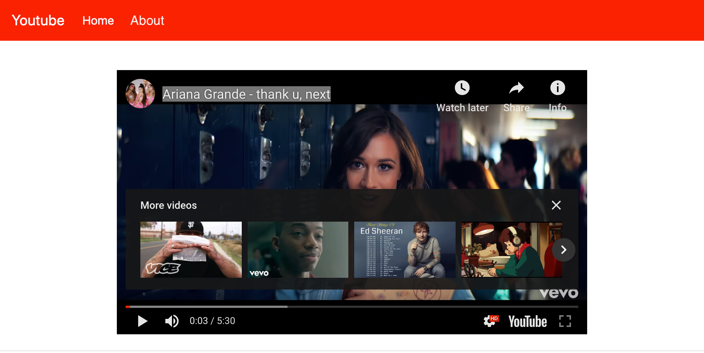

# Requirements

The requirements for this project are included below.

## Interface

Your project should look something like the screenshots below. However, you are free to be as creative as you like once you have finished the core requirements.

### Path: `/`

### Path: `/videos/:id`

## Features

You must implement all of the user stories and acceptance criteria below. After those are completed, look at and implement as many of the [stretch features](./stretch-features.md) as you want to.

### User stories

1. I can navigate between the "Home" page and the "About" page using a nav bar.
1. I can learn about the project and developers on the "About" page.
1. I can see a search bar on the `home` page that allows me to get a list of videos based on my search criteria.
1. I can click on a video thumbnail in order to get to a page that will let me play the video I am interested in.
1. I can share the link to the individual video and someone else will be able to see the same video.
1. I can visit this app on the internet.
1. Have UI/UX for `something went wrong` for returning a 400 status, using a [modal window](https://blog.hubspot.com/website/modal-web-design)

### Acceptance criteria

1. I can use the nav bar to navigate between the "Home" page and "About" page.
1. I can see an "About" page at the URL `/about` that has:

   - The nav bar.
   - A brief project description.
   - A short bio of each teammate.
   - Links to each teammate's GitHub.

1. I can see the "Home" page at the URL `/` which has:

   - The nav bar.
   - A search bar and submit button.
     - After submitting a search, a list of videos should appear.
     - After submitting a search, the search bar should be cleared of any input.
   - Each video that appears on this page should have a thumbnail and title that the user can click on to see a new page.
     - After clicking on the title, the user should be brought to a new page for that specific video.

1. I can see the individual "View" page of a video. The URL should be `/videos/:id` where `:id` is the video ID from the Youtube API. The page should have:

   - The nav bar.
   - The individual video view.
     - This video view should, at minimum, have a playable video from YouTube.

1. I can see a modal that overlays the page when I get a 400 error

- I should be able to click an x or outside the modal to exit the message
- I should be able to try my search again, once the modal is closed

### Code Quality Rubric

- Use JSX to create components.
- Use `create-react-app` to build a React app.
- Use `fetch` to make API calls.
- Use `react-router-dom` to create different views.
- Use `youtube-react` to create a Youtube component for viewing videos from the Youtube API.
- Respond to user input to make an API call to the YouTube API.
- Use state to build a stateful React application.
- Use CSS to make a responsive and attractive app with decent interface.
